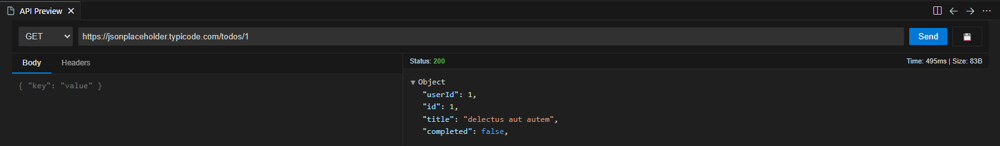

# API Preview for VS Code

**API Preview** is a lightweight, integrated REST API client for Visual Studio Code. Test HTTP requests, inspect JSON responses, and manage your API history without leaving your editor.

## ✨ Features

- **🚀 Integrated API Client**: Send `GET`, `POST`, `PUT`, `DELETE`, and `PATCH` requests directly from VS Code.
- **🌲 Interactive JSON Tree**: View complex JSON responses in a collapsible, color-coded tree view.
- **💾 Workspace History**: Save your requests to the Sidebar for quick access later.
- **⚡ One-Click Replay**: Click any saved request in the sidebar to instantly load its configuration.
- **📝 Dual-Tab Editor**: Separate tabs for Request Body and Headers with JSON syntax highlighting.
- **⏱ Performance Metrics**: Real-time tracking of Request Status, Time, and Size.

## 🎯 How to Use

### 1. Open the Preview
- Open the Command Palette (`Ctrl+Shift+P` or `Cmd+Shift+P`).
- Type **"API Preview: Open New Request"**.

### 2. Send a Request
- Select your HTTP Method (GET, POST, etc.).
- Enter the URL (e.g., `https://jsonplaceholder.typicode.com/todos/1`).
- (Optional) Add Headers or Body JSON in the tabs provided.
- Click **Send**.

### 3. Save & Manage Requests
- Click the **Save (💾)** icon next to the Send button.
- Give your request a name (e.g., "Fetch User Profile").
- It will appear in the **"Saved Requests"** view in the Sidebar (Activity Bar).
- **Right-click** a saved request in the sidebar to delete it.

## ⚙️ Requirements

- VS Code version 1.85.0 or higher.

## 🔧 Extension Settings

This extension currently uses your Workspace State to store saved requests, ensuring your history remains specific to the project you are working on.

## ⌨️ Shortcuts

| Command | Description |
| --- | --- |
| `apiPreview.open` | Open the API Preview Panel |
| `apiPreview.deleteRequest` | Delete a saved request from the sidebar |

## 🤝 Contributing

Contributions are welcome! Please follow these steps:
1. Fork the repository.
2. Create a feature branch (`git checkout -b feature/AmazingFeature`).
3. Commit your changes (`git commit -m 'Add some AmazingFeature'`).
4. Push to the branch (`git push origin feature/AmazingFeature`).
5. Open a Pull Request.

## 📄 License

This project is licensed under the MIT License - see the [LICENSE](LICENSE) file for details.

---

**Enjoying API Preview?** Please leave a review on the Marketplace or star the repository on GitHub!